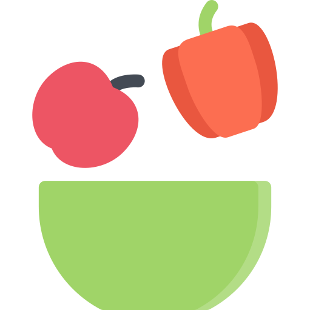

# HEALTHY-FOOD





> Healthy Food é uma aplicação feita com React, Next, TypeScript, Sass e Bootstrap; Para o consumo da API ViaCEP foi utilizado Axios.

### 💚 Ajustes e melhorias

O projeto ainda está em desenvolvimento e as próximas atualizações serão voltadas nas seguintes tarefas:

- [x] Projeto inicializado
- [x] Views
- [x] Consumo da API
- [x] Projeto Finalizado

## 🔗 Api consumida

[Via CEP](https://viacep.com.br/)

## 🧑‍💻 Tecnologias

- Typescript
- Next.js
- React  
- Bootstrap
- Sass
- Axios

## 💻 Pré-requisitos

Antes de começar, verifique se você atendeu aos seguintes requisitos:

* Você instalou a versão mais recente de `<Yarn>`
* Você adicionou as seguintes bibliotecas  `<Axios / Bootstrap>`.
* Você leu o `<passo_a_passo_de_intalação_do_projeto>`.

## 🍐 Instalando `<Healthy-Food>`

Para instalar o `<Healthy-Food>`, siga estas etapas:

Caso não possua o Yarn, instale o Node.js em seu site oficial:

[Node.js](https://nodejs.org/en/download/)

e:

```
<npm install --global yarn>
```

Clone o projeto:
```
<git clone https://github.com/danielafarias/Healthy-Food.git>
```

Em seguida, adicione as bibliotecas e dependências necessárias:
```
<cd Healthy-Food>
```
```
<yarn install>
```
```
<yarn add next>
```
```
<yarn add react>
```
```
<yarn add react-dom>
```
```
<yarn add axios>
```
```
<yarn add react-bootstrap>
```
```
<yarn add react-icons>
```


## 🥑 Usando `<Healthy-Food>`

Para usar `<Healthy-Food>`:

```
<yarn dev>
```

Voilà!

[http://localhost:3000](http://localhost:3000)


## 🥗 Contribuindo para `<Healthy-Food>`

Para contribuir com `<Healthy-Food>`, siga estas etapas:

1. Bifurque este repositório.
2. Crie um branch: `git checkout -b <healthy_seu_nome>`
3. Faça suas alterações e confirme-as: `git commit -m '<sua_mensagem_de_commit>'`
4. Envie para o branch original: `git push origin <master> / <https://github.com/danielafarias/Healthy-Food>`
5. Crie a solicitação de pull.

Como alternativa, consulte a documentação do GitHub em [como criar uma solicitação pull](https://help.github.com/en/github/collaborating-with-issues-and-pull-requests/creating-a-pull-request).

## 🤝 Colaboradores

Seguintes pessoas contribuíram para este projeto:

<table>
  <tr>
    <td align="center">
      <a href="https://github.com/danielafarias">
        <br>
        <sub>
          <b>Daniela Farias</b>
        </sub>
      </a>
    </td>
  </tr>
</table>

## 📝 Licença

Esse projeto está sob licença ⚖️. Veja o arquivo [LICENÇA](LICENSE.md) para mais detalhes.

[⬆ Voltar ao topo](#healthy-food)<br>

```
© README.md template by iuricode
```
